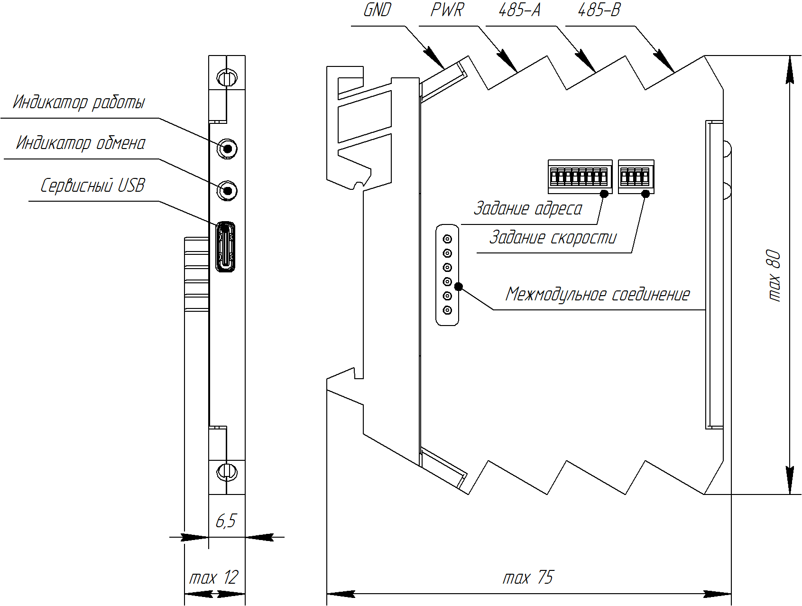

Внешний вид
-----------

Модуль BRIOM выполнен в пластиковом корпусе и крепится на DIN-рейку.

С лицевой стороны расположены два двухцветных светодиодных индикатора:

*	Индикатор работы.  В нормальном режиме работы мигает зеленым цветом 1 раз в секунду. При возникновении системных ошибок мигает красным. Сообщения об ошибках можно считать из FIFO-буфера.

*	Индикатор обмена. При обмене по интерфейсу RS-485 мигает зеленым. При возникновении ошибок обмена мигает красным. При высокой частоте опроса может постоянно светиться зеленым при успешном обмене или красным при частом возникновении ошибок.

Так же с лицевой стороны расположен сервисный разъем USB для подключения к ПК. При подключении модуль определяется как виртуальный COM-порт и так же может быть опрошен по протоколам ModBUS-RTU и ModBUS-ASCII без прерывания обмена по основному интерфейсу RS-485.

С верхней стороны расположены клеммы питания и интерфейса RS-485.

С нижней стороны расположены клеммы каналов модуля. Назначение клемм зависит от типа модуля.

